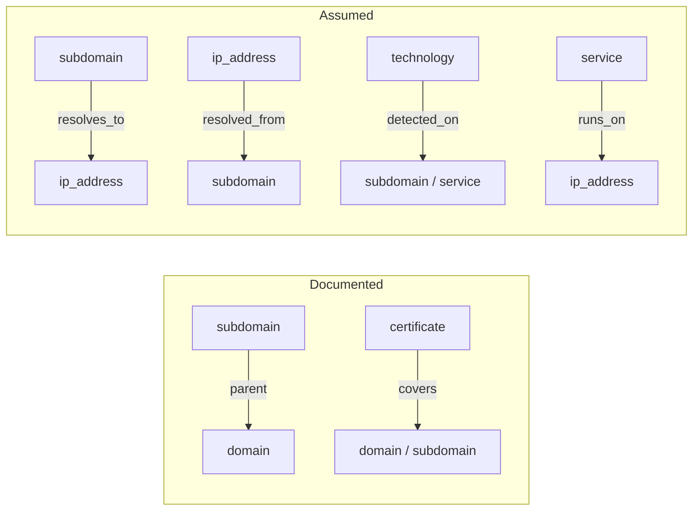
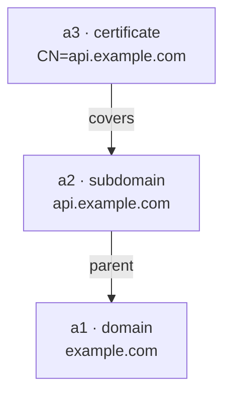
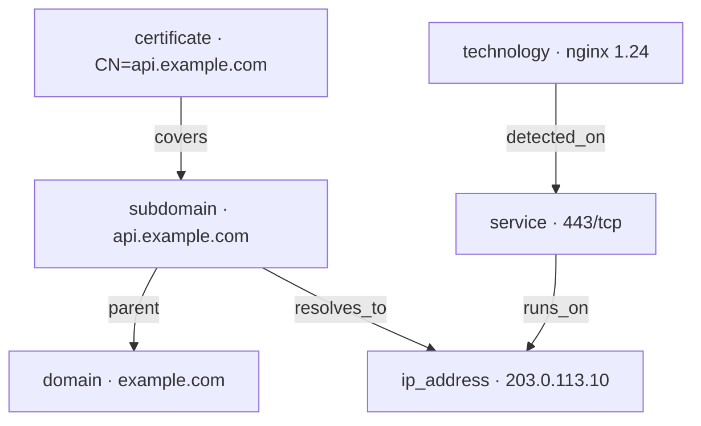

# Asset Management System

A self-contained module of the **DarkAtlas Attack Surface Monitoring (ASM)** platform. It ingests discovered assets (domains, subdomains, IPs, services, certificates, technologies), deduplicates them, tracks lifecycle and relationships, and exposes a REST API for querying and reporting.

Built for **Track A — Backend Engineering** using **Python · FastAPI · PostgreSQL**.

---

## Quick start

### Prerequisites

- [Docker](https://docs.docker.com/get-docker/) and Docker Compose

### Run with one command

```bash
cp .env.example .env
docker compose up --build
```

This starts:

- **PostgreSQL** on port `5432`
- **API** on port `8000` (migrations run automatically on startup)

### Verify

- Swagger UI: [http://localhost:8000/docs](http://localhost:8000/docs)
- ReDoc: [http://localhost:8000/redoc](http://localhost:8000/redoc)

### First request (auth flow)

All asset and relationship endpoints require a JWT. Sign up, log in, then call the API with the token.

```bash
# 1. Register an organization
curl -X POST http://localhost:8000/api/v1/auth/signup \
  -H "Content-Type: application/json" \
  -d '{"name":"Acme Corp","email":"admin@acme.com","password":"secret123"}'

# 2. Log in
curl -X POST http://localhost:8000/api/v1/auth/login \
  -H "Content-Type: application/json" \
  -d '{"email":"admin@acme.com","password":"secret123"}'

# 3. Create an asset (use the access_token from step 2)
curl -X POST http://localhost:8000/api/v1/assets/ \
  -H "Authorization: Bearer <access_token>" \
  -H "Content-Type: application/json" \
  -d '{"id":"a1","type":"domain","value":"example.com","status":"active","source":"scan","tags":["root"],"metadata":{}}'
```

---

## Environment variables

Copy `.env.example` to `.env` and adjust as needed.

| Variable                          | Description                                    | Default                                                        |
| --------------------------------- | ---------------------------------------------- | -------------------------------------------------------------- |
| `DATABASE_URL`                    | PostgreSQL connection string                   | `postgresql://postgres:your_password@db:5432/asset_management` |
| `JWT_SECRET_KEY`                  | Secret used to sign JWTs                       | _(required in production)_                                     |
| `JWT_ALGORITHM`                   | JWT signing algorithm                          | `HS256`                                                        |
| `JWT_ACCESS_TOKEN_EXPIRE_MINUTES` | Token lifetime in minutes                      | `1440`                                                         |
| `EXPIRING_SOON_DAYS`              | Window for “expiring soon” certificate queries | `30`                                                           |
| `RATE_LIMIT_REQUESTS`             | Max requests per IP per window                 | `100`                                                          |
| `RATE_LIMIT_WINDOW`               | Rate limit window in seconds                   | `60`                                                           |

Secrets must **not** be committed. Only `.env.example` is tracked in the repo.

---

## API overview

Base path: `/api/v1`

| Area             | Endpoints                                                                              |
| ---------------- | -------------------------------------------------------------------------------------- |
| **Auth**         | `POST /auth/signup`, `POST /auth/login`                                                |
| **Assets**       | CRUD on `/assets/`, list with filters, `POST /assets/import`, `GET /assets/{id}/graph` |
| **Certificates** | `GET /assets/expiring-soon`, `GET /assets/expired`                                     |
| **Relations**    | `GET /relations/`, `POST /relations/`                                                  |

Full interactive documentation: [http://localhost:8000/docs](http://localhost:8000/docs)

### List / filter assets

```
GET /api/v1/assets/?type=domain&status=active&tag=prod&value=example&sort_by=first_seen&sort_order=asc&page=1&limit=20
```

| Query param      | Purpose                                              |
| ---------------- | ---------------------------------------------------- |
| `type`           | Filter by asset type                                 |
| `status`         | Filter by lifecycle status                           |
| `tag`            | Filter assets containing this tag                    |
| `value`          | Case-insensitive substring match on `value`          |
| `sort_by`        | `type`, `status`, `value`, `first_seen`, `last_seen` |
| `sort_order`     | `asc` or `desc`                                      |
| `page` / `limit` | Pagination (default limit: 20, max: 100)             |

### Bulk import

```
POST /api/v1/assets/import
```

Accepts a JSON array of asset records (same shape as the sample dataset). Returns counts of `created`, `updated`, `failed`, `relationships_created`, and an `errors` list. Returns **207 Multi-Status** when any record fails; **200** when all succeed.

---

## Design decisions

### Multi-tenancy (bonus)

Every asset and relationship is scoped to an **organization**. JWT subject is the organization UUID. Queries always filter by `organization_id`, so one tenant cannot see another’s data.

### Deduplication

An asset is considered the same when `(type, value, organization_id)` matches. Re-importing or re-creating updates the existing row instead of inserting a duplicate:

- `last_seen` is refreshed
- `tags` are merged (union, no duplicates)
- `metadata` is shallow-merged (incoming keys overwrite existing keys)
- `source` is appended if the new source is not already recorded
- A **stale** asset automatically returns to **active** on re-sighting

`first_seen` is set once at creation and never changed.

### Lifecycle

| Status     | Meaning                                                                   |
| ---------- | ------------------------------------------------------------------------- |
| `active`   | Currently observed / in use                                               |
| `stale`    | Not seen recently; returns to `active` on re-importManually set via PATCH |
| `archived` | Manually retired via PATCH                                                |

Certificate-specific helpers read `metadata.expires` (ISO date string):

- `GET /assets/expiring-soon` — expires within `EXPIRING_SOON_DAYS`
- `GET /assets/expired` — already past expiry

### Asset creation vs. relationships

`POST /assets/` **creates the asset only.** It does not create graph edges.

Relationships can be created in two ways:

1. `POST /relations/` — explicit edge creation
2. `POST /assets/import` — optional relationship fields on each record are parsed and edges are created after all assets in the batch are upserted

This matches the sample dataset shape (`parent`, `covers`, etc.) while keeping single-asset creation simple.

### Create endpoint idempotency

`POST /assets/` is upsert-aware:

- **201 Created** — new asset
- **200 OK** — duplicate detected; existing asset updated (same dedup rules as import)

### Bulk import resilience

Each record is validated and processed inside a **savepoint**. A malformed or failing record increments `failed` and is listed in `errors` without aborting the rest of the batch.

### Authentication

JWT bearer auth is required on **all** asset and relation routes (reads and writes). Signup/login are public. This is stricter than the task minimum (write-only auth) but fits a multi-tenant security product.

### Rate limiting (bonus)

In-memory per-IP rate limiting middleware returns **429** when limits are exceeded.

### Database

- SQLAlchemy ORM + Alembic migrations
- PostgreSQL enums, JSONB metadata, array columns for tags/sources
- Indexes on commonly filtered columns (`type`, `organization_id`, etc.)
- Asset `id` is a **string** (stable scan identifier), not a generated UUID

---

## Assumptions

The task document defines some relationships explicitly (Appendix A). Others are inferred from ASM semantics and implemented consistently in code and import parsing.

### Relationship types

All relationships are **directed edges**: `(from_id) ──type──▶ (to_id)`.

| From            | To                      | Relation type   | Source                | Import field    |
| --------------- | ----------------------- | --------------- | --------------------- | --------------- |
| **subdomain**   | **domain**              | `parent`        | Document (Appendix A) | `parent`        |
| **certificate** | **domain / subdomain**  | `covers`        | Document (Appendix A) | `covers`        |
| **subdomain**   | **ip_address**          | `resolves_to`   | Assumed               | `resolves_to`   |
| **ip_address**  | **subdomain**           | `resolved_from` | Assumed               | `resolved_from` |
| **technology**  | **subdomain / service** | `detected_on`   | Assumed               | `detected_on`   |
| **service**     | **ip_address**          | `runs_on`       | Assumed               | `runs_on`       |

**Direction convention:** the edge always originates from the _dependent_ asset pointing to what it depends on or is observed on — e.g. a subdomain **parent** is its domain; a certificate **covers** a host; a service **runs_on** an IP.

The document describes “ip_address ↔ subdomain (resolution)” as bidirectional in prose. In this implementation it is modeled as **two optional directed types** (`resolves_to` and `resolved_from`) rather than a single undirected link, so imports can express either direction explicitly.

### Other assumptions

| Topic                    | Assumption                                                                                                             |
| ------------------------ | ---------------------------------------------------------------------------------------------------------------------- |
| **Asset identity**       | `(type, value)` is the canonical dedup key per organization; `id` is client-supplied and stored as provided            |
| **Source field**         | Single value on input; stored as an accumulating list when the same asset is seen from multiple sources                |
| **Metadata conflicts**   | Shallow merge; latest import wins per key. Certificate `expires` is always updated from incoming metadata on re-import |
| **Status on re-import**  | Stale assets become active automatically; explicit `status` in the payload can still override                          |
| **Graph query**          | `GET /assets/{id}/graph` performs BFS from the root asset and returns all reachable nodes and unique edges             |
| **Relation uniqueness**  | Composite primary key `(from_id, to_id, type)` — duplicate edges are rejected                                          |
| **Filtering**            | “Value contains” is implemented as the `value` query parameter (case-insensitive substring)                            |
| **Pagination defaults**  | Page 1, 20 items per page, sorted by `last_seen` descending                                                            |
| **Service value format** | Free-form string (e.g. `443/tcp`); no strict parser enforced                                                           |
| **Write auth scope**     | JWT required for reads as well as writes (see Design decisions)                                                        |

---

## Asset relationship graph

### Type legend



### Example from the sample dataset (Appendix A)



Import payload shape:

```json
[
    {
        "id": "a1",
        "type": "domain",
        "value": "example.com",
        "source": "scan",
        "tags": ["root"]
    },
    {
        "id": "a2",
        "type": "subdomain",
        "value": "api.example.com",
        "source": "scan",
        "tags": ["prod"],
        "parent": "a1"
    },
    {
        "id": "a3",
        "type": "certificate",
        "value": "CN=api.example.com",
        "source": "scan",
        "metadata": { "issuer": "Let's Encrypt", "expires": "2025-01-02" },
        "covers": "a2"
    }
]
```

### Typical attack-surface chain



### Graph API response

`GET /api/v1/assets/{id}/graph` returns:

```json
{
    "root_asset_id": "a1",
    "nodes": [
        /* AssetGraphNode[] */
    ],
    "edges": [
        /* { "from": "...", "to": "...", "type": "parent" } */
    ]
}
```

---

## Running tests

Tests live in `tests/` and cover deduplication, filtering, pagination, relationships, and bulk import.

### With Docker (recommended)

```bash
docker compose up -d db
docker compose run --rm \
  -e DATABASE_URL=postgresql://postgres:password@db:5432/asset_management \
  api sh -c "alembic upgrade head && PYTHONPATH=/app/app:/app python -m pytest /app/tests -v"
```

### Locally

Requires a running PostgreSQL instance and `DATABASE_URL` set (see `.env.example`).

```bash
pip install -r requirements.txt
alembic upgrade head
pytest tests -v
```

---

## Project structure

```
├── app/
│   ├── api/v1/endpoints/   # Route handlers (assets, auth, relations)
│   ├── core/               # Config, database, security
│   ├── crud/               # Database access layer
│   ├── middleware/         # Rate limiting
│   ├── models/             # SQLAlchemy models & enums
│   ├── schemas/            # Pydantic request/response models
│   └── services/           # Business logic
├── alembic/                # Database migrations
├── tests/                  # Pytest suite
├── docker-compose.yml
├── Dockerfile
└── .env.example
```

---

## What I would do next

- GitHub Actions CI running tests on every push
- Role-based access control beyond organization-scoped JWT
- Standalone HTML/JS graph viewer consuming `GET /assets/{id}/graph`
- LangChain analysis layer (Track B bonus feature)

---

## License / confidentiality

This project was built as the Buguard DarkAtlas internship acceptance task. Treat the task brief as confidential.
